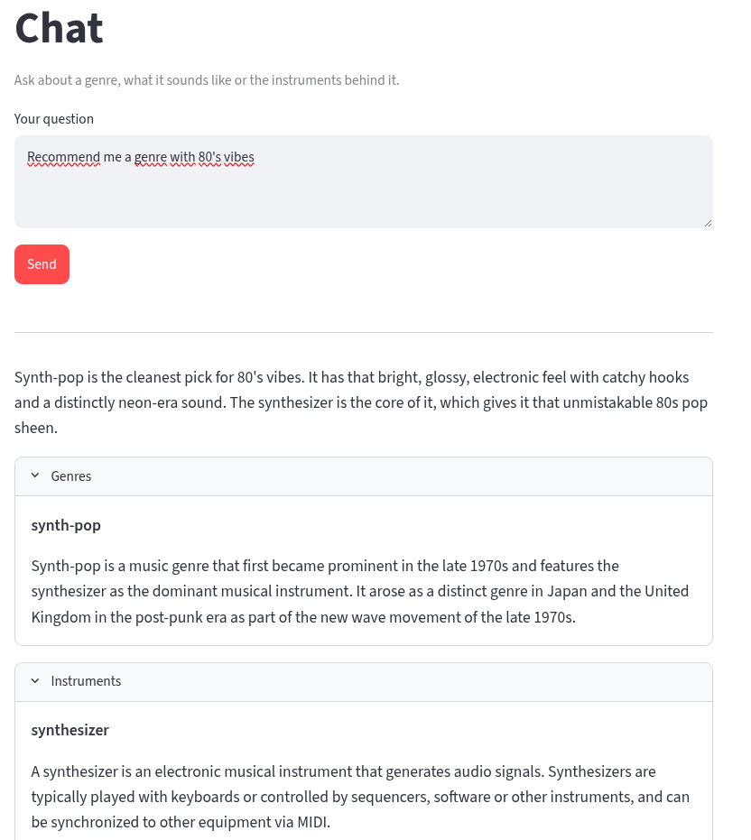

# Musical genres RAG

Application to get information about genres. It recommends genres and users based on their questions.
The aim of this application is allowing people to explore musical genres. There is a big amount of them
and trying to view all of them can be overwhelhimg. With this, you can just about vibes, instruments, or 
dates and you will find related genres.

## How it works

The app works by ingesting genres and instruments from CSV files. For the academic project purpose, the data is limited to 10 genres related between them. This content is normalized and saved into a Postgres database. With this data, an index is generated to find genres and instruments based on a user query. With the retrieved data, a query is sent to the rag to elaborate a dedicated answer to the user's question.

Conversations provided by the RAG have a single-answer; this means, that there is no history recording. It gives one and solid answer.

## Data source

Data comes from [MusicBrainz](https://musicbrainz.org/). The entire database has been downloaded as tsv files and, with the help of a [script](./scripts/generate-dataset.py), a sample of their genres and instruments have been extracted into the data folder CSV files.
We just have a sample and not the entire database for two reason:
* Speed up 

## Evaluation criteria

- To check the code , look into src, scripts and data (this last one contains the sql file that loads the data).
- To check the scripts used for setup and processes (before using airflow), check on Makefile.
- To check the prompts used, look at config.yml.dist
- To check the architecture, look Dockerfile and docker compose.
- To check the python assets used, check on pyproject.toml and uv.lock.
- There are more documentation to evaluate into docs into docs.

## Usage

Read [USAGE](./USAGE.md) to know how to use it.

## Stack

* Django to make the API , python commands and manage the database.
* Redis to cache the entities.
* Postgres to query the normalized entitiees, adapted to our business logic, and to index the content and perform searches. It has these extensions:
  * pgvector for the embed databases
  * pg_textsearch for BM25 text search.
* Streamlit to show dashboards and allow chatting.
* Airflow to manage from UI all the processes needed to make the app work.
* Grafana to view realtime activity of the application.

## Next steps

In the case somebody would like to deploy it to production, this needs some work:
* Improve performance of data loading to be multithreaded.
* Load music data straight from tsv files instead of using the sample CSV files.
* Add authentication and implement all the needed security.
* Isolate chat from the administrative pages. Chat can stay anoymous and the rest of pages for authenticated users.
* Test that the rag performs well with the big dataset.
* Refine documentation and arquitecture, it needs polishing as it has been prototiped with AI.

That should be the most important points to release it.

# AI Transparency

The code that was critical for me, from scratch to the RAG, and the Postgres container has been coded by me. Then I moved to do the code with Claude Code so it could follow my coding patterns and I am able to guide it to do what the app needs. I've used plans to be able to refine scoped tasks that keeps it scalable.

All the application and code has been tested and verified by me. The README, USAGE and config.yml.dist files have been fully written by me, so the most important documentation is direct and clear.

## Data license

The content is derived from [MusicBrainz](https://musicbrainz.org/) data and is licensed under
[CC BY-NC-SA 3.0](https://creativecommons.org/licenses/by-nc-sa/3.0/).

Descriptions come from [Wikidata](https://www.wikidata.org/) and the English Wikipedia, reached
through the links MusicBrainz itself records — the same source musicbrainz.org renders. Wikidata is
[CC0](https://creativecommons.org/publicdomain/zero/1.0/); Wikipedia text is
[CC BY-SA 4.0](https://creativecommons.org/licenses/by-sa/4.0/).
