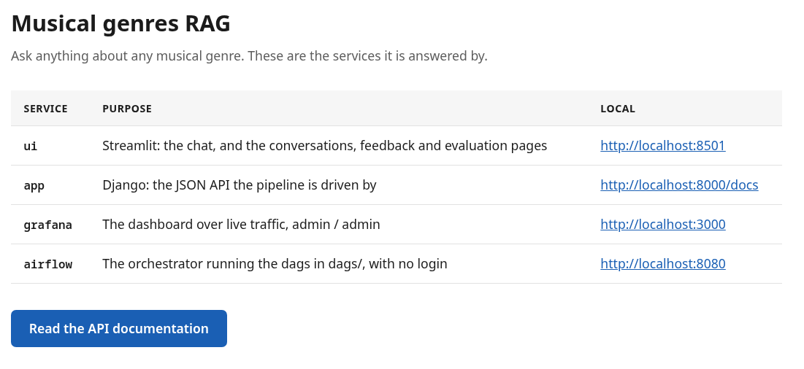
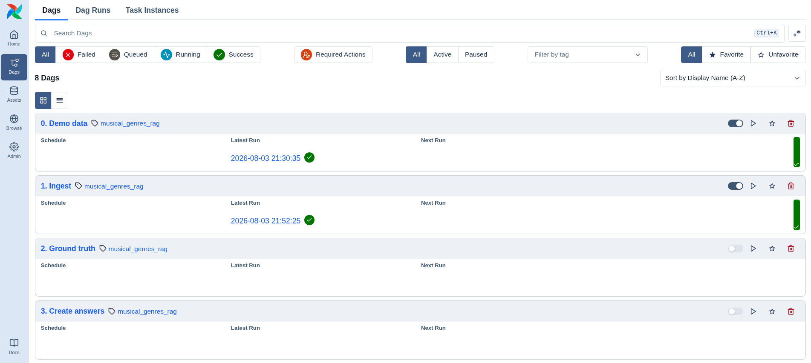
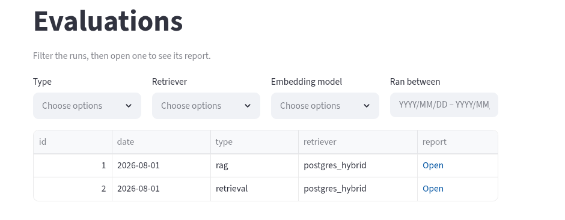
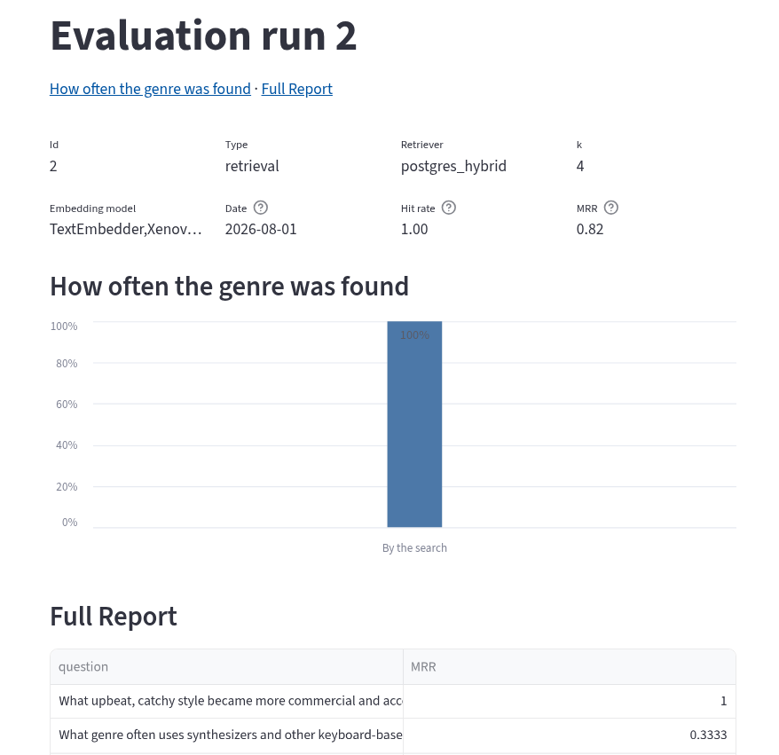
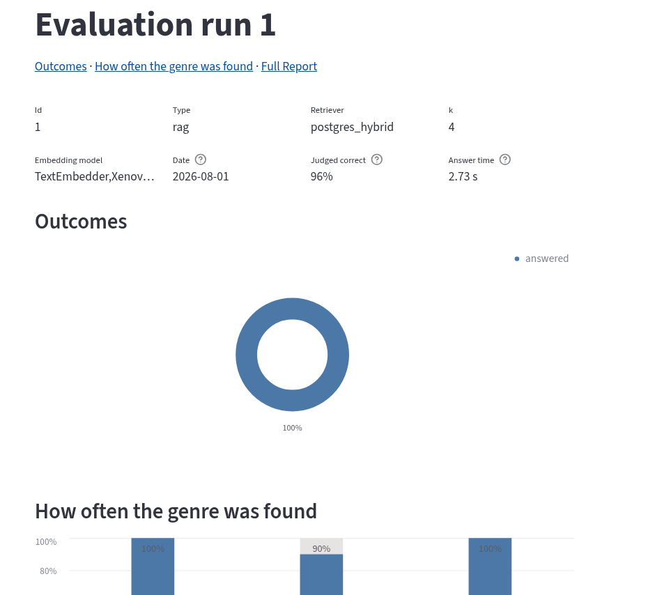
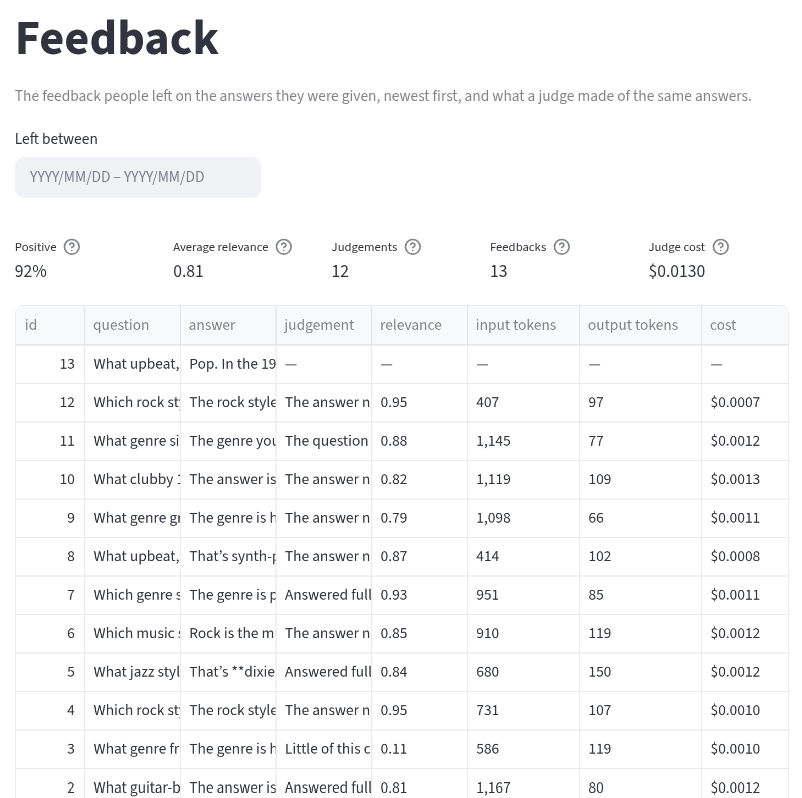
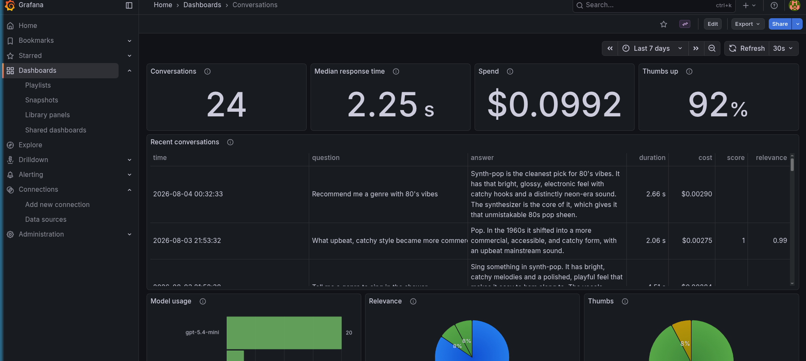

# Usage

This document aims to explain how to use the entire application.

## Install

First, you must install:
* [Make](https://man7.org/linux/man-pages/man1/make.1.html) to perform the initial setup.
* [Docker](https://www.docker.com/) and [Docker compose](https://docs.docker.com/compose/) to deploy the application locally.
* [uv](https://docs.astral.sh/uv/) to require python dependencies
* **Optional**: an OpenAI account to use the chat. Optional because, if you just want to see the final results, you can use airflow to load demo data.

Then, you can install the project by running:
```bash
make setup
```

That's all. It will deploy the docker compose application, install the python dependencies,
download the embedding model, and load the initial data into the database.

After installing, everytime you need to start up the app, run

```bash
make start
```

## How to use it

First, go to the dashboard at http://localhost:8000 . Here you will see all the accesible pages:



* Airflow: Used to feed the index, run evaluations and load the demo data.
* ui: Chat with the RAG, view the evaluations and the Feedback.
* grafana: View realtime stats of the app.
* app: It contains the initial dashboard and the API used by airflow to manage the app without needing to use comands.

Refer to this section to guide yourself to do the rest of the operations commented below. Every next action will rely on these pages.

### Ingesting data

To index all the data into the database:

1. Go to the airflow instance. YOu will see all the processes needed to run the application here:



2. Click into DAGs.
3. Select ingest.
4. Click trigger.
5. CLick trigger again.

Note that it requires you to select an index engine. THe index engine is what it allows to perform text , embed or hybrid search. It is recommended leaving as postgres_hybrid.

### Loading demo data
If you want to check the final results without spending OpenAI tokens, you can go to the airflow dashboard and run the following DAGs:
* 0. demo: It will load into the database two recorded evaluations. One evaluation of the rag, and another evaluation of the retrieval.
* 7. Sample traffic : Emulate a chat and adds complete simulated feedback for ~30 seconds.

After running this, go to ui and view evaluations and feedback.

### Chatting

To chat with the RAG you need to set the OPENAI_API_KEY in .env, and run the ingest previously. 

Then, go to ui > Chat, and start chatting with AI. After viewing a response, you can like or dislike it dis

### Running evaluations

Please note that running evaluations can spend a lot of tokens as it make lots OpenAI requests over all the questions generated.

If you want to view the performance of the rag, you can run evaluations. TO do that, you need to run in airflow in order:

1. "2. Ground truth" to generate the ground truth. It will generate 5 questions based on the saved data.
2. "3. Create Answers" to generate the answers based on the ground truth.
3. "4. Evaluate Retrieval" to evaluate the performance of the retrieval.
4. "5. Evaluate RAG" to evaluate the entire RAG.

Some of this processes are disabled by default, you should enable them first. However, they are configured to run manually.

The processes are done separate because , you may want to run several evaluations over the same answers. Same comes for creating answers from the same ground truth. Keeping it separate makes easier to evolve the quality of the reports or the quality of the answers generated.

### Viewing evaluation results

To view evaluations, got to ui and click into evaluations. Then you will see all the ran evaluations:



Every evaluation has its own page:

* Retrieval:



* RAG:



### Viewing feedback

Feedback stores the likes and dislikes of users. Also, this data is used to perform an automatic feedback  judgement process, run by the airflow feedback process, that uses llm as a judge to evaluate the quality of the feedback. The llm will provide a explanation of how good is the answer, plus it will score from 0 to 1.



**Important**: Please note that feedback airflow DAG must be enabled so it run automatically. After it, it will judge rated conversations every 5 minutes (spending openai tokens).

### Viewing stats

Go to grafana. Then select dashboards and choose 'Conversations'. YOu will see a variety of stats:



Some examples of the stats are:
* Total of conversations
* Response time
* % thumbs up
* Etc.

Feel free to watch all the stats running the demo data (see "Loading demo data" section).
They allow to measure the behaviour of the app, by just querying the RAG results that are saved into database.
