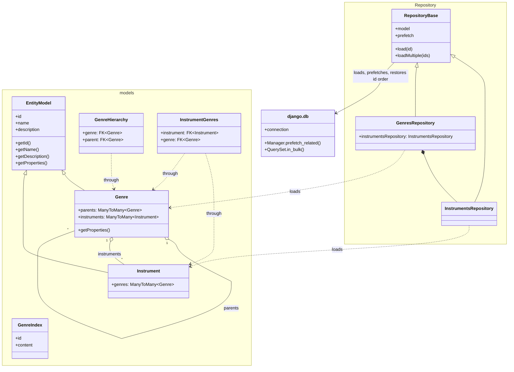

# Class diagram

Classes under `src/musical_genres_rag`.

Persistence is Django's: `models.py` holds the ORM models, connections come from
`django.db`, and the schema lives in `migrations/`. `Repository` survives only as a
thin ordering-preserving facade over the managers.



## The API

`Api.py` is a second entry point onto the same builders `manage.py` goes through, so what an
orchestrator runs and what a shell runs are one piece of code. It waits for none of it: the work
goes to a thread and the caller is handed the task it reads the outcome from. See
[api.md](api.md) for the endpoints themselves.

```mermaid
classDiagram
    direction LR

    class Api {
        +api: NinjaAPI
        +dispatch(operation, payload, work, failure)
        +ingesting(engine)
        +generating()
        +answering(engine)
        +evaluating(runner, engine, info)
        +judging(limit)
        +download(request, attachment_id)
        +attachmentUrl(id, baseUrl)
    }

    class BackgroundTasks {
        +spawn(work, progress, failure)
    }

    class OperationLock {
        +operation
        +take(task)
        +holder()
        +release()
    }

    class Progress {
        +operation
        +start(phase, total)
        +enter(phase)
        +advance(amount)
        +finish(result)
    }

    class CacheProgress {
        +task
        +current
        +total
    }

    class Services["services.py"] {
        +buildGenresIndex()
        +buildGenresGroundTruth()
        +buildGroundTruthAnswers()
        +buildGenresRagEvaluationRunner()
        +buildGenresRetrievalEvaluationRunner()
        +buildFeedbackRelevanceJudge()
        +buildConversationsRepository()
        +buildJudgeBatchRepository()
    }

    Progress <|-- CacheProgress
    Api --> BackgroundTasks : hands the work to
    Api --> OperationLock : refuses a second run with
    Api --> CacheProgress : opens one per task
    Api ..> Services : builds through, as the commands do
    BackgroundTasks --> Progress : finishes
    CacheProgress --> Cache["django.core.cache"] : one document per task
    Index ..> Progress : counts entities indexed
    GroundTruth ..> Progress : counts genres asked about
    EvaluationRunner ..> Progress : counts cases scored
    FeedbackRelevanceJudge ..> Progress : counts answers judged
```

`Progress` reports nowhere by default, so a `make` target pays nothing for it and no class below
has to know whether anybody is watching.

## Entry points

The `uv` scripts became `manage.py` subcommands, wired through `services.py`:

| Command | Does |
|---|---|
| `manage.py ingest` | Rebuilds `genre_index` from every stored genre |
| `manage.py rag [question]` | Answers a question from the indexed context |
| `manage.py groundtruth [--output]` | Regenerates the ground truth question set |
| `manage.py debug [--mode]` | `renderers`, `genres` or `queries` inspection |

| `manage.py downloadModel` | Fetches the weights the vector engines embed with |

`PostgresSearchEngine` still issues raw SQL through `django.db.connection`: neither the bm25
operator (`content <@> to_bm25query(...)`) nor the distance one (`embed <=> '[…]'::vector`) has an
ORM expression.

## Searching

One engine, three modes, named after what each of them writes and searches:

| Engine | Writes | Searches by | Embedded by |
|---|---|---|---|
| `postgres_text` | `genre_index.content` | bm25, over `genre_index_text` | the renderer alone |
| `postgres_embed` | `genre_index.embed` | cosine distance, over the hnsw index | `Xenova/all-MiniLM-L6-v2`, run locally through ONNX |
| `postgres_hybrid` | both | both, fused by `ReciprocalRankFusion` | both |

`hybrid` reads each half deeper than the limit asked for and then cuts back to it, adding
`1 / (60 + rank)` per ranking: a bm25 score and a cosine distance are not the same kind of number
and are never added, so only the rank each half gave is read. `Vectorizer` keeps one ONNX session
per process — an embedder is built per entity indexed, and the weights are read off disk once.
