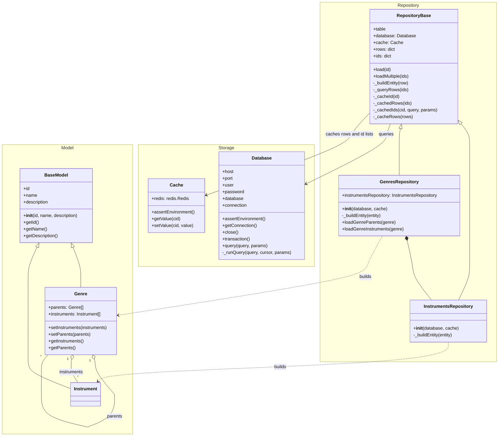

# Class diagram

Classes under `src/musical_genres_rag`.

```mermaid
classDiagram
    direction TB

    namespace Model {
        class BaseModel {
            +id
            +name
            +description
            +__init__(id, name, description)
            +getId()
            +getName()
            +getDescription()
        }

        class Genre {
            +parents: Genre[]
            +instruments: Instrument[]
            +setInstruments(instruments)
            +setParents(parents)
            +getInstruments()
            +getParents()
        }

        class Instrument {
        }
    }

    namespace Storage {
        class Cache {
            +redis: redis.Redis
            +assertEnvironment()
            +getValue(cid)
            +setValue(cid, value)
        }

        class Database {
            +host
            +port
            +user
            +password
            +database
            +connection
            +assertEnvironment()
            +getConnection()
            +close()
            +transaction()
            +query(query, params)
            -_runQuery(query, cursor, params)
        }
    }

    namespace Repository {
        class RepositoryBase {
            +table
            +database: Database
            +cache: Cache
            +rows: dict
            +ids: dict
            +load(id)
            +loadMultiple(ids)
            -_buildEntity(row)
            -_queryRows(ids)
            -_cacheId(id)
            -_cachedRows(ids)
            -_cachedIds(cid, query, params)
            -_cacheRows(rows)
        }

        class InstrumentsRepository {
            +__init__(database, cache)
            -_buildEntity(entity)
        }

        class GenresRepository {
            +instrumentsRepository: InstrumentsRepository
            +__init__(database, cache)
            -_buildEntity(entity)
            +loadGenreParents(genre)
            +loadGenreInstruments(genre)
        }
    }

    BaseModel <|-- Genre
    BaseModel <|-- Instrument
    RepositoryBase <|-- InstrumentsRepository
    RepositoryBase <|-- GenresRepository

    Genre "1" o-- "*" Genre : parents
    Genre "1" o-- "*" Instrument : instruments

    RepositoryBase --> Database : queries
    RepositoryBase --> Cache : caches rows and id lists
    GenresRepository *-- InstrumentsRepository

    InstrumentsRepository ..> Instrument : builds
    GenresRepository ..> Genre : builds
```
